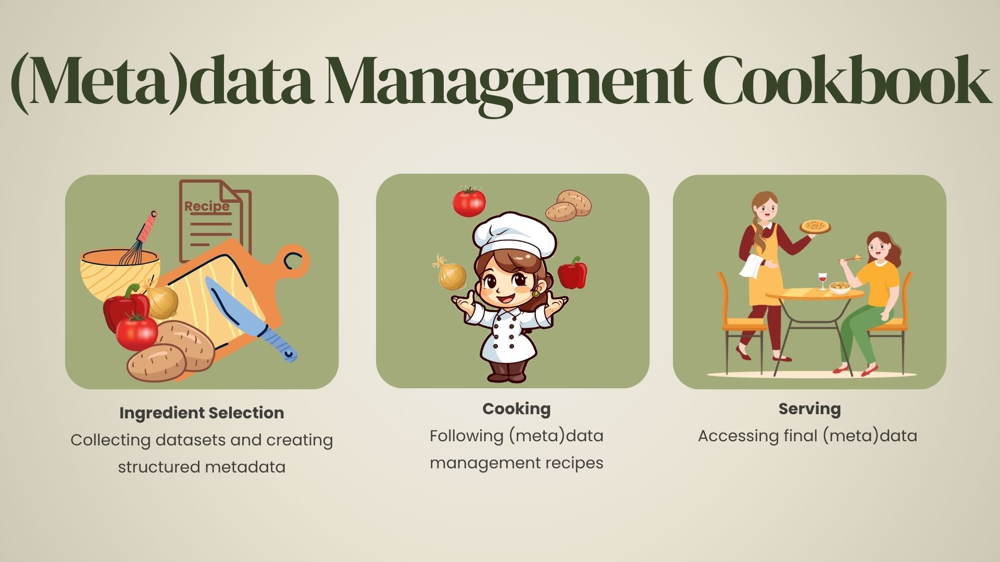

# Introduction
The (Meta)data Management Cookbook is a simple and practical guide which walks users through the key phases of the (meta)data management process based on the [FAIR principles](https://rdcu.be/ewN9f). Its scope is to give a basic understanding of the (meta)data management process as well as to provide practical use cases that users can follow. This cookbook highlights services developed and offered by [Scientific Computing Center](https://www.scc.kit.edu) (SCC), the Information Technology Center of the [Karlsruhe Institute of Technology](https://www.kit.edu) (KIT). These tools are customized to meet the specific requirements of different projects.

    

This (Meta)data Management Cookbook is structured around three phases:
- **Ingredient selection**: represents the metadata creation phase, where users are guided in creating structured metadata based on defined schemas.
- **Cooking**: corresponds to the (meta)data management phase, where users can explore best practices for storing and maintaining (meta)data.
- **Serving**: aligns with (meta)data access phase, where users learn how to make their (meta)data accessible, legally reusable, and how to access (meta)data created by others.

The proposed cookbook is intended as a helpful example. It is required to follow it strictly or use the suggested services. However, be aware that skipping or modifying steps may impact later stages of the process.
This quick cookbook offers a basic understanding. For more deeper insights into research data management, online courses are available: [Metadata Management: Key Essentials](https://publikationen.bibliothek.kit.edu/1000181088), [Fundamentals of Scientific Metadata](https://carpentries-incubator.github.io/scientific-metadata/), etc.
If you have additional questions or suggestions to improve this cookbook, please feel free to contact [us](mailto:training@scc.kit.edu).  
An introductory video to the (meta)data management cookbook is available [here](https://www.youtube.com/watch?v=BjJ-oKrttPk).