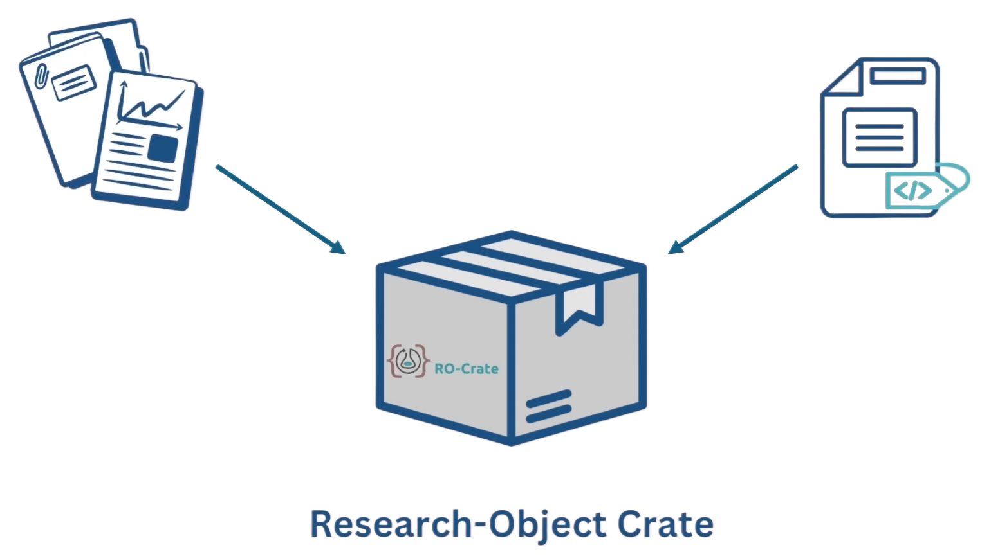

# Getting Started with Research Object Crates

**Description**:
Research outputs often consist of more than individual data files or metadata documents. They also include authors, documentation, software, publications, and relationships between these resources. [Research Object Crates (RO-Crates)](https://www.researchobject.org/ro-crate/about_ro_crate) provide a standardised way to organise these resources as a single research object, making them easier to share, reuse, and align with FAIR principles. This section guides you through the basic operations for working with RO-Crates using NovaCrate. The section is divided into the following recipes:

- [**Introduction to NovaCrate**](recipe-intro-to-novacrate.md): provides an overview of the NovaCrate interface and its main features.
- [**Creating a New Crate**](recipe-create-new-crate.md): explains how to create a minimal RO-Crate.
- [**Editing an Existing Crate**](recipe-edit-existing-crate.md): shows how to import, open, and modify an existing RO-Crate.
- [**Adding Files to a Crate**](recipe-add-files-to-crate.md): demonstrates how to associate research files with an RO-Crate.
- [**Adding Authors to a Crate**](recipe-add-authors-to-crate.md): explains how to add and link author information to an RO-Crate.

    

**Prerequisites**:

- Basic familiarity with [RO-Crate](https://www.researchobject.org/ro-crate/about_ro_crate) concepts.
- Curiosity and an interest in FAIR research data management.

**Ingredients**: 
- Web browser.
- Access to the NovaCrate web application.

**Time Needed**:
Approx. 1 hour

**Level of Difficulty**:
Beginner.