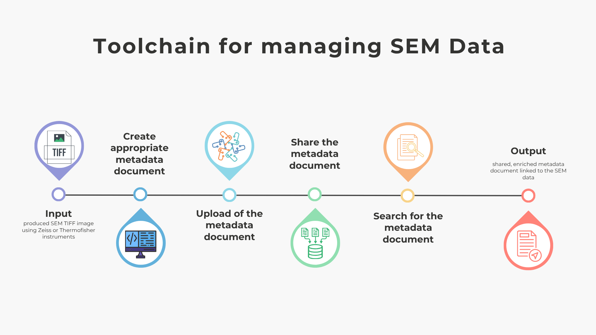

# A Toolchain for managing SEM data
**Description**:
This recipe guides you through practical steps to make your SEM (Scanning Electron Microscopy) data easier to share with collaborators, better findable, and legally reusable. The goal is to enhance discoverability and reusability of SEM data by aligning it with FAIR principles.
The use case is divided into 3 main steps each presented as a separate section:
- [**Metadata Creation**](recipe-metadata-creation.md): covers how to generate automatically metadata documents from SEM data
- [**(Meta)data Management**](recipe-metadata-management.md): includes how to upload metadata documents to a Metadata Repository instance and how to share the metadata document  by adding a license and updating the access permissions.  
- [**(Meta)data Access**](recipe-metadata-access.md): describes how to search for and access the metadata document using the search component.

    

**Prerequisites**:
-  Familiarity with (meta)data management concepts
- A dose of enthusiasm and curiosity 

**Ingredients** : 
- An SEM TIFF Image is available online via this [link](https://matwerk.datamanager.kit.edu/api/v1/dataresources/c729a6d9-d2d2-4f4b-8bb4-ea7444620b1f/data/SCeO5_17.tif). If you already produced your own SEM TIFF image using the Zeiss or Thermofischer instruments and shared it online, you can optionally use it.
- Installed Metadata Editor desktop application: a detailed documentation on how to install it is available [here](https://metadata-editor.gitlab.io/documentation/Download/).
- Web browser

**Time Needed**:
Approx. 1 hour

**Level of Difficulty**:
Beginner

